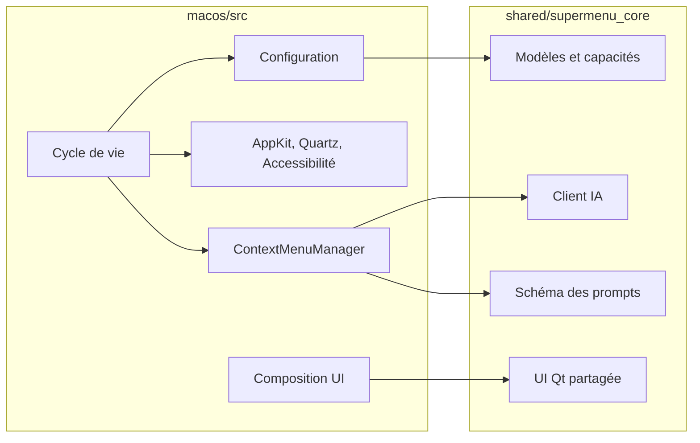
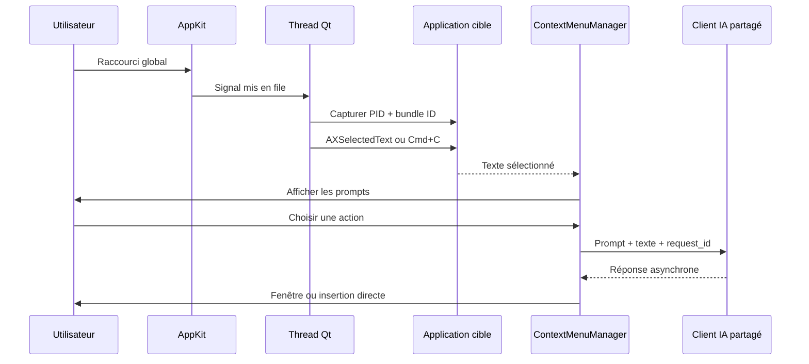

# Architecture technique de SuperMenu pour macOS

Ce document décrit la composition macOS, ses frontières avec le cœur partagé,
les flux AppKit/Qt, la sécurité d’insertion et la chaîne de distribution.

## Principes directeurs

La version macOS suit quatre règles :

1. **Séparation de plateforme** : aucun import de `win32/` et aucune couche
   unique chargée de faire vivre deux OS.
2. **Métier partagé** : fournisseurs IA, modèles, prompts, validateurs et
   composants Qt génériques restent dans `shared/supermenu_core`.
3. **Boucle principale non bloquée** : les attentes utilisent le scheduler Qt,
   jamais un `sleep` sur le thread principal.
4. **Cible explicite** : toute lecture ou insertion est associée à une
   application capturée par PID et bundle identifier.

La composition macOS propose le texte et la dictée en direct. La capture
microphone Qt, `DictationSession` et la fenêtre de transcription résident dans
`shared/supermenu_core`. `src/audio/speech_backend.py` choisit OpenAI ou Apple
Speech via `native/SpeechHelper.swift` (macOS 26+). La permission Microphone est
demandée avant la capture. La capture d’écran reste propre à Windows.

Le service partagé de modèles résidents conserve le processus Apple Speech
entre les dictées et ouvre une nouvelle session pour chaque capture. Il le
décharge après cinq minutes d’inactivité par défaut, selon le réglage choisi.
Le microphone est arrêté entre les dictées et aucun audio n’est sauvegardé.

L’éditeur de prompts vocaux, le menu vocal, la persistance et l’assemblage de
l’instruction avec la transcription et la sélection sont partagés avec Windows.
`VoicePromptEditor` émet l’identifiant du prompt ; `ContextMenuManager` capture
la cible et lit la sélection avec les services natifs macOS avant de lancer
`DictationSession`. Seul le résultat final déclenche une requête vers le moteur
de texte sélectionné. L’insertion et le suivi des requêtes réutilisent le même
parcours que les prompts textuels. Une annulation ignore les résultats tardifs.

Les fichiers JSON échangés utilisent `text_prompts` et `voice_prompts`, avec
compatibilité de lecture des anciens exports Mac (`prompts`). Les imports
valident toutes les collections avant écriture et conservent les collections
absentes. La composition Mac ne dépend d’aucun module Windows.

## Vue d’ensemble



Le cœur partagé ne connaît pas la plateforme. La couche macOS adapte ses
interfaces : paramètres, présentation, insertion et accès au fournisseur.

### Fournisseur Apple Foundation Models

`src/api/apple_foundation_client.py` implémente les mêmes signaux de requête
que le client HTTP. `ContextMenuManager` choisit ce client lorsque `ai_provider`
vaut `apple`. Les configurations existantes sont migrées à partir de
`use_custom_endpoint` au premier choix d’un fournisseur.

Chaque demande lance `native/FoundationModelsHelper.swift`, compilé en exécutable
arm64 et embarqué dans le bundle par PyInstaller. Le protocole utilise un objet
JSON sur stdin puis un objet JSON sur stdout ; le texte n’apparaît ni dans la
ligne de commande, ni sur disque, ni dans les journaux. Les erreurs natives
deviennent des codes stables et des messages français. Aucune requête réseau
ni bascule automatique vers un autre fournisseur n’est effectuée par ce client.

`QProcess` conserve l’interface réactive ; une vérification de disponibilité a
un délai de 15 secondes, une génération de 120 secondes. Fermer l’application
tue les processus encore actifs. Chaque génération crée une nouvelle session
Apple pour éviter l’accumulation de contexte. Les erreurs de contexte sont
affichées sans tronquer silencieusement la sélection.

Le build utilise Xcode 26.2 sur les runners macOS 15. Le framework est lié
faiblement avec une cible macOS 12 et ses appels sont protégés par une vérification
macOS 26. Le helper compilé puis sa copie signée dans le bundle sont testés via
le protocole de disponibilité, y compris sur un runner sans Apple Intelligence.
La qualité des générations doit être validée sur un Mac compatible avec le
modèle activé.

## Arborescence

```text
macos/
├── src/
│   ├── main.py                     # cycle de vie et instance unique
│   ├── api/openai_client.py        # client partagé en mode texte
│   ├── config/
│   │   ├── build_info.py           # version et canal du package
│   │   └── settings.py             # QSettings, prompts et migrations
│   ├── ui/
│   │   ├── main_window.py          # configuration, barre des menus, updater
│   │   ├── prompt_dialog.py        # dialogue partagé
│   │   └── response_window.py      # présentation et insertion macOS
│   └── utils/
│       ├── accessibility_text.py   # lecture AXSelectedText
│       ├── clipboard_manager.py    # snapshot et restauration conditionnelle
│       ├── context_menu.py         # sélection → IA → réponse
│       ├── hotkey_manager.py       # moniteurs AppKit et enregistreur Qt
│       ├── key_events.py           # événements Copier/Coller Quartz
│       ├── permissions.py          # autorisation Accessibilité
│       ├── selection.py            # lecture asynchrone de la sélection
│       ├── text_inserter.py        # collage asynchrone sécurisé
│       ├── updater.py              # manifests et sélection du DMG
│       └── window_target.py        # identité et activation de la cible
├── scripts/                        # build, signature et notarisation
├── tests/
├── entitlements.plist
├── SuperMenu-macos.spec
└── run.py
```

## Frontière avec le cœur partagé

`shared/supermenu_core` possède :

- le client OpenAI et endpoints compatibles ;
- les capacités de modèles et options de raisonnement ;
- les prompts textuels et leur validation ;
- le dialogue de prompt et la fenêtre de réponse de base ;
- les thèmes, indicateurs, validateurs et dialogues sûrs ;
- le masquage des blocs de raisonnement.

La composition macOS possède :

- le bootstrap `QApplication` et l’instance unique ;
- l’icône de barre des menus ;
- les moniteurs clavier AppKit ;
- l’autorisation Accessibilité ;
- la lecture AX et le repli presse-papiers ;
- l’activation et l’identité des applications ;
- l’émission des événements Quartz ;
- la configuration, les logs et le packaging.

Les adaptateurs restent minces : le client macOS désactive les images, le
dialogue de prompt réexporte le composant commun et la fenêtre de réponse
fournit `TextInserter` à sa base partagée.

## Amorçage et cycle de vie

`run.py` propose l’exécution normale et `--smoke-test`. Le smoke test vérifie
les ressources packagées, la version, le canal, les APIs de permission et les
callbacks PyObjC nécessaires aux moniteurs natifs.

`src/main.py` :

1. installe le journal de crash ;
2. crée `QApplication` avec `quitOnLastWindowClosed(False)` ;
3. garantit une instance unique avec `QLocalServer` / `QLocalSocket` ;
4. construit les réglages, l’orchestrateur et le service de raccourcis ;
5. connecte les signaux natifs aux slots Qt ;
6. crée la fenêtre principale et applique le thème ;
7. affiche les permissions si nécessaire, sinon reste dans la barre des menus ;
8. planifie la vérification quotidienne de mise à jour.

Une seconde instance signale l’instance existante, qui présente sa fenêtre,
puis se termine. À la fermeture réelle, les moniteurs, clients, requêtes et
fenêtres sont fermés explicitement.

## Raccourcis globaux

### Normalisation

`normalize_hotkey()` transforme `Command`, `Control`, `Option`, etc. vers une
forme canonique. La validation exige un modificateur, refuse les doublons et
protège des raccourcis système comme `Cmd+Q`, `Cmd+Space` et les commandes de
fenêtres réservées à macOS.

L’enregistreur est un dialogue Qt. `_modifier_labels()` traduit les
modificateurs Qt vers les touches physiques macOS afin que Command et Control
soient affichés correctement.

### Moniteurs AppKit persistants

`_MacOSGlobalHotKeys` installe deux moniteurs `NSEvent` :

- global pour les événements destinés aux autres applications ;
- local lorsque SuperMenu est actif.

Ils restent en place pendant toute la vie de l’application. Modifier un
raccourci remplace uniquement la table des bindings sous verrou.

`HotkeyService` fusionne trois propriétaires : menu principal, mode
personnalisé et prompts individuels. Une combinaison ne peut appartenir qu’à
un seul propriétaire. Le service est suspendu pendant l’enregistrement d’un
raccourci afin de ne pas déclencher une ancienne action.

Le callback AppKit ne lance jamais le menu directement. Il émet un signal remis
en file vers le thread Qt, ce qui évite la réentrance dans le gestionnaire
`NSEvent`.

## Capture et activation de la cible

`PasteTarget` représente l’application externe par son PID, son bundle
identifier et son nom. Le PID seul n’est pas suffisant : il peut être réutilisé
après la fermeture d’une application. Le bundle identifier est donc revérifié
avant chaque réactivation.

La dernière cible externe est mémorisée juste avant que la fenêtre de
configuration ou la barre des menus active SuperMenu. Une action lancée depuis
l’UI peut ainsi revenir vers l’application que l’utilisateur venait de quitter.

L’activation préfère les APIs coopératives modernes. Le chemin historique
`NSApplicationActivateIgnoringOtherApps` n’est utilisé qu’en compatibilité si
macOS n’honore pas la première demande.

Les vérifications de focus sont planifiées. Dormir sur le thread Qt empêcherait
`NSWorkspace` et `NSRunningApplication` de rafraîchir leurs propriétés via la
boucle principale.

## Lecture de la sélection

`SelectionReader` utilise deux chemins ordonnés.

### Chemin Accessibilité

`AccessibilitySelectionReader` demande l’élément focalisé puis
`kAXSelectedText`. Une réponse non vide termine immédiatement la lecture sans
événement clavier ni modification du presse-papiers.

Cette API n’est pas universelle. Certaines applications Electron, Java ou vues
personnalisées n’exposent rien d’exploitable.

### Repli presse-papiers

Si Accessibilité ne répond pas :

1. la cible est validée et réactivée ;
2. le presse-papiers est capturé ;
3. une sentinelle unique y est placée ;
4. SuperMenu attend le relâchement des modificateurs ;
5. `Cmd+C` est émis avec Quartz ;
6. le presse-papiers est interrogé à courts intervalles ;
7. la sélection est livrée ;
8. l’ancien contenu est restauré seulement si aucun tiers ne l’a modifié.

La sentinelle distingue une absence de sélection d’un ancien texte resté dans
le presse-papiers.

## Événements Copier/Coller

`KeyEventPoster` utilise CoreGraphics plutôt qu’une résolution de caractères :

- les key codes `C` et `V` sont positionnels et compatibles avec les
  dispositions non latines ;
- `CGEventSetFlags` assigne explicitement Command sans fusionner les touches
  que l’utilisateur tient encore ;
- Command reçoit ses propres événements down/up et ne reste pas « collée » ;
- l’intervalle de suppression locale est nul pour ne pas bloquer la souris.

L’attente du relâchement des modificateurs est bornée et planifiée par Qt.

## Flux menu → IA → réponse



`ContextMenuManager` empêche deux menus ou lectures de sélection de se
chevaucher. Il conserve les requêtes par `request_id` et garde un ancien client
IA en vie jusqu’à la fin de ses requêtes lorsqu’un réglage change.

Un prompt normal prépare la fenêtre avant l’appel réseau. Une insertion directe
utilise un indicateur près du curseur. La réponse peut ensuite être affichée,
copiée, réinsérée ou renvoyée par **Réessayer**.

## Insertion sécurisée

`TextInserter.insert_text_async()` suit cette séquence :

1. validation de la cible ;
2. activation coopérative ;
3. vérification différée ;
4. activation forcée de compatibilité si nécessaire ;
5. snapshot puis écriture du presse-papiers ;
6. attente du relâchement des modificateurs ;
7. dernière vérification de la cible ;
8. émission de `Cmd+V` ;
9. restauration conditionnelle du presse-papiers.

Une cible différente provoque une annulation explicite au lieu d’un collage au
mauvais endroit.

## Configuration, secrets et journaux

`Settings` utilise `QSettings` au format INI :

```text
~/Library/Application Support/SuperMenu/SuperMenu.ini
```

Le fichier est créé avec des permissions `0600` et contient endpoints, clés,
modèles, raisonnement, raccourcis, prompts, thème et canal de mise à jour. Les
prompts passent par le schéma partagé avant leur activation.

La composition macOS n’utilise pas le Trousseau. Cette décision évite les
demandes répétées des anciens builds ad hoc, au prix d’un secret protégé par le
compte utilisateur plutôt que par Keychain.

Les journaux sont écrits dans :

```text
~/Library/Logs/SuperMenu/supermenu.log
~/Library/Logs/SuperMenu/native-crash.log
```

Ils décrivent les phases et erreurs sans inclure les secrets, sélections ou
prompts.

## Permission Accessibilité

`permissions.py` charge `AXIsProcessTrusted` pour lire l’état et
`AXIsProcessTrustedWithOptions` via HIServices pour déclencher le dialogue
natif. La lecture de statut ne doit jamais afficher de dialogue.

L’UI n’ouvre les Réglages Système qu’après la demande native afin d’éviter deux
fenêtres concurrentes. Le polling de l’état n’est actif que lorsque la fenêtre
de configuration est visible, ce qui évite les réveils inutiles en arrière-plan.

## Updater macOS

| Canal | Manifeste | Asset |
|---|---|---|
| Stable | `update-macos-stable.json` | `SuperMenu-macOS-arm64.dmg` |
| Beta | `update-macos-beta.json` | `SuperMenu_Beta-macOS-arm64.dmg` |

Le manifeste version 1 valide plateforme `macos`, architecture `arm64`, canal,
prerelease, version SemVer, tag et nom exact du DMG.

Le manifeste est essayé avant l’API REST GitHub. En repli, l’API est interrogée
mais la recherche exige toujours le nom exact du DMG. L’application ouvre le
téléchargement ; elle ne se remplace pas pendant son exécution.

## Packaging et notarisation

`SuperMenu-macos.spec` produit un bundle PyInstaller `arm64` avec le bundle
identifier `com.supermenu.macos`, les ressources, le Hardened Runtime et
`entitlements.plist`.

Les entitlements autorisent les mécanismes dynamiques requis par PyObjC/libffi.
Sans eux, le runtime durci tue le processus lors de la création des callbacks
Objective-C des moniteurs globaux.

`scripts/build_dmg.sh` :

1. génère l’icône et exécute PyInstaller ;
2. vérifie strictement la signature ;
3. lance le smoke test packagé ;
4. notarie et agrafe `SuperMenu.app` si les secrets sont présents ;
5. copie le bundle avec `ditto` dans un volume avec lien Applications ;
6. crée et signe le DMG.

Le `.app` est notarié avant son entrée dans le DMG, car le ticket du volume ne
suit pas l’application après son déplacement. `notarize_dmg.sh` soumet ensuite
le volume, agrafe son ticket et le valide.

Voir [SIGNING.md](../SIGNING.md) pour les certificats et secrets.

## CI et releases

### CI

Le workflow commun teste le cœur et Windows sous Python 3.10/3.12, puis le cœur
et macOS sous Python 3.12. Il exécute compilation, pytest, lint critique, smoke
test et build DMG. Une configuration Apple partielle échoue explicitement.

### Beta

Après une CI réussie sur `main`, Windows et macOS construisent en parallèle.
La publication attend les deux plateformes et contient EXE, installateur, DMG
signé/notarié, manifests et checksums SHA-256.

### Stable

Un tag `vMAJOR.MINOR.PATCH` correspondant à `win32/VERSION` déclenche une
release Stable immuable. `macos/VERSION` reste indépendant et apparaît dans le
manifeste macOS.

Les tests s’exécutent avant l’injection des métadonnées de packaging dans
`build_info.py`. Les tests source ne confondent ainsi jamais la version du dépôt
avec une version Beta générée.

## Stratégie de tests

Des frontières injectables autour d’AppKit, Quartz, HIServices, du
presse-papiers et du scheduler permettent de vérifier :

- normalisation et conflits de raccourcis ;
- cycle de vie des moniteurs global/local ;
- événements Command cohérents et relâchement sur erreur ;
- lecture AX et repli presse-papiers ;
- restauration conditionnelle ;
- activation coopérative puis forcée ;
- annulation lors d’un changement de cible ;
- permissions et comportement UI ;
- sélection stricte des DMG ;
- entitlements et scripts de notarisation.

Le smoke test du binaire signé installe réellement les blocs PyObjC. Il détecte
les erreurs de Hardened Runtime qui provoqueraient un crash natif plutôt qu’une
exception Python.

## Règles d’évolution

- Le métier commun va dans `shared/supermenu_core`.
- AppKit, Quartz et permissions restent dans `macos/src`.
- Une attente de focus ou presse-papiers doit être asynchrone et bornée.
- Toute insertion conserve et revalide un `PasteTarget`.
- Le packaging conserve smoke test, signature stricte et agrafage du `.app`.
- Un nouvel asset possède un nom déterministe, un manifeste et un checksum.

Retour au [README macOS](../README.md) ou au
[README principal](../../README.md).
